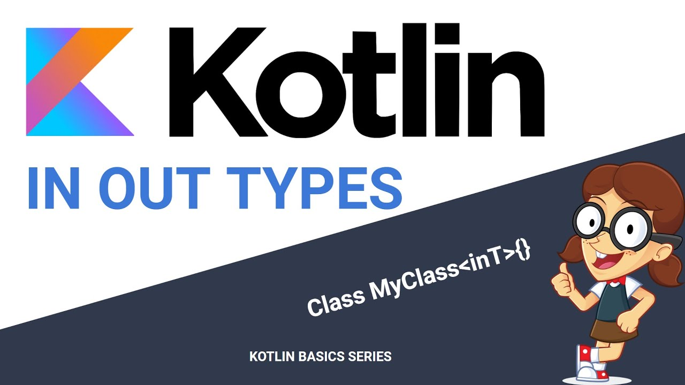

# 泛型型变



泛型的形变非常类似于Java的`? extends`和`? super`语法，这个有点晦涩难懂，我们今天就展开来详细解释一下。

最近正好赶上垃圾分类的热潮，我们就以此举例吧！

垃圾(rubbish)包括有害垃圾(harmful rubbish)，可以认为有害垃圾是垃圾的子类。垃圾桶是垃圾的集合(容器)，里面可以承装普通垃圾和有害垃圾。而有害垃圾桶只能承装有害垃圾。

用Java实现上面的例子：
```java
class Rubbish {

}

class HarmfulRubbish extends Rubbish{

}

class Test {
    public static void main(String[] args) {
        List<Rubbish> rubbishContainer = new ArrayList<>();
        List<HarmfulRubbish> harmfulRubbishContainer = new ArrayList<>();
        
        rubbishContainer.add(new Rubbish());
        rubbishContainer.add(new HarmfulRubbish());
        harmfulRubbishContainer.add(new HarmfulRubbish());
        harmfulRubbishContainer.add(new Rubbish()); //这行报错，有害垃圾桶不能装普通垃圾
    }
}
```

有害垃圾继承垃圾，理所当然，有害垃圾桶应当也继承垃圾桶，即`List<HarmfulRubbish> extends List<Rubbish>`, 所以，下面的代码应该完全成立：
```kotlin
List<Rubbish> rubbishContainer = new ArrayList<HarmfulRubbish>();
```
然而，你却惊奇的发现，上面的这一行代码报错了，编译器认为类型`List<HarmfulRubbish>`与类型`List<Rubbish>`无关，也就是说这两个集合类型/泛型类型之间并没有存在继承关系。

这是Java中为了保证运行时安全，将泛型进行了类型擦除，所以泛型类型之间不存在直接的继承关系。

为了解决这个问题，Java使用了语法`? extends`来标注，告诉编译器，这个垃圾桶里面可以承载继承了所有垃圾类的垃圾：

```java
List<? extends Rubbish> rubbishContainer = new ArrayList<HarmfulRubbish>(); // 这一行正确
rubbishContainer.add(new Rubbish()); // 编译报错
rubbishContainer.add(new HarmfulRubbish()); // 编译报错
```

使用这个新的语法解决了泛型类之间的继承关系，但是很快出现了新的问题，我们向垃圾桶里面装垃圾的方法报错了。。。。

这是为什么呢？

很简单，你可以这么理解，`? extends Rubbish`将垃圾桶进行了泛化，限定这个垃圾桶可能是普通的垃圾桶，也可能是有害垃圾桶，但是必须是他们两者之中的某一个，假设你创建的是一个有害垃圾的垃圾桶，那么你向这个垃圾桶里面丢普通垃圾可以么？当然是不可以的，那丢有害垃圾呢？编译器从安全的角度考虑，也不允许这么做。

那么能否从这个泛化的垃圾桶里面取垃圾呢？当然可以，不管是有害垃圾桶还是垃圾桶，取出来的都叫垃圾，所以可以随便取，即下面的代码是正确的：
```java
List<? extends Rubbish> rubbishContainer = new ArrayList<HarmfulRubbish>();
Rubbish rubbish = rubbishContainer.get(1);
```

所以，使用`? extends`语法定义的泛型类一旦定义完成就不能被修改，只能够向外提供数据被消费, 这种行为被称为`协变`。

> 在继承关系树中，子类继承自父类，可以认为父类在上，子类在下。extends 限制了泛型类型的父类型，所以叫上界。

在Kotlin中，使用`out`关键字来表示这个语法：

```kotlin

```