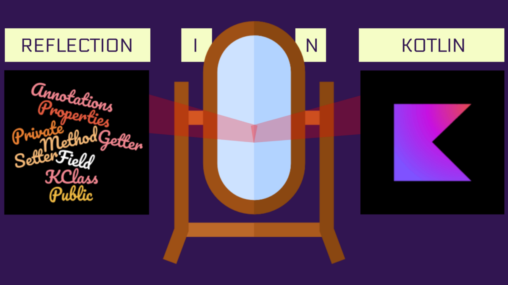

# 反射



学过Java等语言的同学们都知道，反射是允许程序在运行时访问程序结构的一类特性，程序运行时结构可以认为是元数据，包括类，接口，方法，属性等语法特性。

Java的反射API由于内置在Java虚拟机中，无需引入额外依赖，首次使用速度相对较快，但缺点是提供的API有限，无法使用Kotlin提供的语法特性。

Kotlin的反射支持Java的几乎所有特性，API设计的也非常友好，但是由于它的反射是独立的反射库，大小约为2.5M，即使是编译之后，还要400k，所以首次调用的时候比较慢。

要在Kotlin中使用反射，必须添加一下依赖：
```kotlin
dependencies {
    implementation "org.jetbrains.kotlin:kotlin-reflect:1.4.20"
}
```

最基本的反射功能是获取`Kotlin`类的运行时引用, 属性引用，函数引用等，下面我们将逐一介绍。

## 类引用

要获取对静态已知的 Kotlin 类的引用，可以使用类字面值`::class`语法。请注意，`Kotlin`类引用与`Java`类引用不同。要获得`Java`类引用， 请在`KClass`实例上使用`.java`属性。
```kotlin
val c = MyClass::class // kotlin类引用
val j = MyClass::class.java // java类引用
```

### 使用类引用创建实例
* 如果此类的构造函数没有参数，可以使用`createInstance()`方法调用无参数构造方法
* 如果此类的构造函数有参数，可以使用`primaryConstructor()`或`constructors()`方法来获取构造函数的引用，进而使用`call()`方法传入参数。

例如：
```kotlin
val clazz = ReflectA::class
val inst1 = clazz.createInstance() // 构造函数无参数时使用

val cons1 = clazz.primaryConstructor // 获取主构造参数
val inst2 = cons1?.call(参入参数) 
 // 或者
 val cons2 = clazz.constructors // 获取所有构造函数的列表
 cons2.get[i].call(参入参数)
```

## 函数引用

函数的引用我们在前面函数部分课程中已经做过介绍了。

在Kotlin中函数是一等公民，是一个独立的类型，能够使用`::`来获取其引用，可以通过这个引用将函数当做其他函数的参数进行传递。

```kotlin
fun isOdd(x: Int) = x % 2 != 0
val numbers = listOf(1, 2, 3)
println(numbers.filter(::isOdd))
```

当上下文中已知函数期望的类型时，`::` 可以用于重载函数。 例如：

```kotlin
fun isOdd(x: Int) = x % 2 != 0
fun isOdd(s: String) = s == "brillig" || s == "slithy" || s == "tove"

val numbers = listOf(1, 2, 3)
println(numbers.filter(::isOdd)) // 引用到 isOdd(x: Int)
```

如果我们需要使用类的成员函数或扩展函数，它需要是限定的，例如`String::toCharArray`。

## 属性的引用

在Kotlin中，也可以通过`::`来获取属性的引用，例如：

```kotlin
val x = 1

fun main() {
    println(::x.get()) // 1
    println(::x.name) // x
}
```

表达式 `::x` 求值为`KProperty<Int>`类型的属性对象，它允许我们使用`get()`读取它的值，或者使用`name`属性来获取属性名。

对于可变属性，返回`KMutableProperty<Int>`类型的一个值， 该类型有一个`set()`方法。

```kotlin
var y = 1

fun main() {
    ::y.set(2)
    println(y) // 2
}
```

属性引用可以用在预期具有单个泛型参数的函数的地方：

```kotlin
val strs = listOf("a", "bc", "def")
println(strs.map(String::length))
```

要访问属于类的成员的属性，我们这样限定它：
```kotlin
class A(val p: Int)
val prop = A::p
println(prop.get(A(1))) // 1
```

## 反射的用途

发射一般用的不多，如果要用，通常用于以下的场景中：
* 列出类型的所有属性、方法、内部类等等
* 调用给定名称及签名的方法，或访问指定名称的属性
* 通过签名信息获取泛型实参的具体类型
* 访问运行时注解及其信息完成注入或者配置操作
