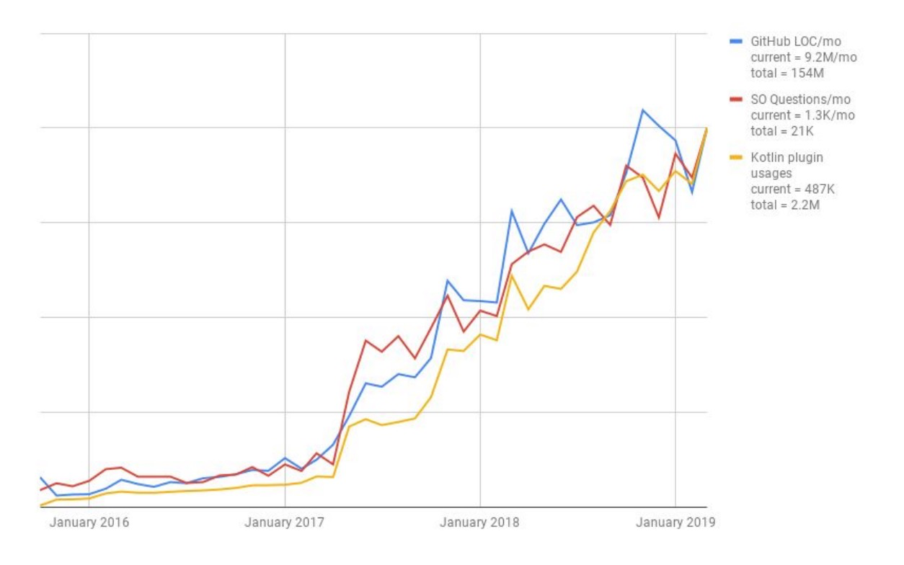

# Kotlin概述

大多数人认识Kotlin是在Andriod平台，Google大力发展Kotlin，将其作为Andriod开发的第一语言。

## Kotlin是什么？

Kotlin是一门用于现代多平台应用的静态编程语言，其中被广泛用于Android平台的开发，被称之为Android世界的Swift。

它由大名鼎鼎的JetBrains公司设计开发并开源，著名的IDE工具IntelliJ IDEA就是他们的产品，所以无疑他们是对编程语言设计领域最为熟悉的专家。

Kotlin 从 2016 年发布 1.0 的 release 版本开始至今，使用的开发者数量快速增长。

此外 Kotlin 已经拥有强大的生态和社区开发者的支持：

* Kotlin 是著名的 IDE 厂商 JetBrains 公司开发的编程语言；
* 在 Google I/O 2017中，Google 宣布在 Android 上为 Kotlin 提供最佳支持；
* Kotlin 在 Spring5.0 后端开发框架中的支持；
* Kotlin DSL 1.0 将在 Gradle5.0 得以应用，Kotlin 成为继 Groovy 语言开发 Gradle 另一门编程语言；
* Kotlin 成为 2018 年 Github 中增长速度最快的语言；
* 2018年10月，Google 和 JetBrains 在 KotlinConf18 上公开宣布了 Kotlin 基金会；
* 2019年5月，谷歌宣布 Kotlin 作为 Android 的首选语言。；
* 2019年7月，Kotlin 在 O’Reilly 开源软件大会（OSCON）2019上赢得了享有声望的年度突破项目奖；

## Kotlin有何过人之处？

相比Java等其他编程语言，Kotlin有着独到的过人之处：

**1. 从设计理念上来说，将语言特性的发展与JVM虚拟机脱钩，做到真正的平台无关性。**

由于一些老的语言，比如Java，JavaScript等，都有一些历史包袱存在，一些新的语言特性要新增到这个里面就需要考虑兼容性。如果要使用新版本语言的特性，就必须将对应的虚拟机升级到更高的版本才行，而这对于很多项目来说，都是很难实现的。

如今的 Kotlin 已经从当初的更好Java目标完成了它华丽的大变身，他们的目标已经瞄准了星辰大海。目前Kotlin可以适用于移动端跨平台、原生JVM、服务端开发、Web 开发、Android开发、数据科学等多个领域。此外近年来 Kotlin 团队已经将重心转移到了语言层面的跨平台，多平台的支持。

另一方面，Kotlin 得益于 Kotlin/JVM、Kotlin/JS、Kotlin/Native 三个语言编译器的后端实现，它不仅仅可以编译成 Java 字节码（Kotlin/JVM），也可以编译成JavaScript(Kotlin/JS)，还能编译成直接运行在不需要任何VM平台的机器代码（Kotlin/Native），可以轻松实现语言层面的跨平台，并实现在多个平台之间共享代码。目前已经部分支持了Linux、Windows、macOS、WebAssembly、Android、iOS以及watchOS和tvOS平台。

**2. 天生的函数式编程理念。**

函数是Kotlin中的一等公民，Kotlin天生支持函数，函数也是有类型的。所以函数在Kotlin中可以被独立的定义。

基于此，Kotlin可以真正的实现Lambda表达式，可以将函数作为参数或者作为返回值来定义高阶函数。

不像Java等语言，严格意义上来说，Java没有函数的概念，有的只是方法，所以，Java的Lambda是借助函数式接口实现的，被人戏称为“伪Lambda”。

**3. 高安全性。**

许多编程语言(包括Java)中最常见的陷阱之一，就是访问空引用的成员会导致空引用异常。在Java中，这等同于`NullPointerException`或简称NPE。空指针异常会导致很多问题和潜在的危险，有人将其称之为[《十亿美元的错误》](https://en.wikipedia.org/wiki/Tony_Hoare#Apologies_and_retractions)。

但是Kotlin致力于消除空引用所带来的危险，所以就有了空类型安全概念。

大家都知道NPE异常是运行时异常，编译期很难发现NPE异常，Kotlin之所以能够很好避免NPE，主要关键在于它对类型系统做了非空和可空类型的划分，并且能在编译期将可能出现NPE的问题提前暴露出来。

除了空类型安全，Kotlin还支持更安全的类型检测和智能类型转化，极大的减少了类型强转带了的风险。

**4. 更简洁，更表意的语法支持。**

在实际编程中，我们经常需要一些数据类来承载数据，这在大部分语言比如Java中非常常见，这些类型只有属性和一些Getter、Setter方法，完全属于一种贫血模型。Kotlin
为此专门定义了一种新的数据类来支持`data class`, 相似的还有单例类`object class`, 枚举类`enum class`, 内联类`inline class`等等，都是为适用各种开发场景专门定义的。

另外，Kotlin推出了表达式语法，比如`if`,`when`, 中缀表达式等，不仅简洁，表意，而且容易上手，极大地提升了开发效率。

据不完全统计，相同的功能，适用Kotlin开发的代码量是Java的60%。

**5. 协程，天然的异步支持。**

像Java这些语言，大多是通过多线程来提高并发量，但是多线程的开发难度和线程的切换带来的开销依然不可小觑。

且对于“生产”与“消费”的进程间架构模型来说，多线程能发挥的价值更是少之又少。

一种天然的异常支持--协程，在Kotlin中应用而生，我们可以使用协程来写出没有阻塞的异步代码，极大的提高程序性能。

## Kotlin的发展历史

* 2010年，JetBrains着手开发Kotlin项目。
* 2011年7月，JetBrains发布Kotlin项目。
* 2012年2月，JetBrains在Apache 2许可证下开源Kotlin项目源码。
* 2016年2月，JetBrains发布第一个稳定版本Kotlin 1.0，并许诺保持向后兼容。
* 2017年3月，Kotlin 1.1版本发布，正式支持JavaScript，并新增了诸多新功能和特性。
* 2017年5月，Google I/O大会上，Google官方确定支持Kotlin语言。
* 2017年11月，Kotlin 1.1.5发布，相比Kotlin 1.0版本，Kotlin有关的代码数目从210万行飞升到1000多万行，对外提供的API也越来越多，使用场景也越来越多。
* 2017年12月，Kotlin 1.2版本发布，除了性能上的明显提升外，1.2版本最重要的特性就是增加了多平台代码重用的能力。