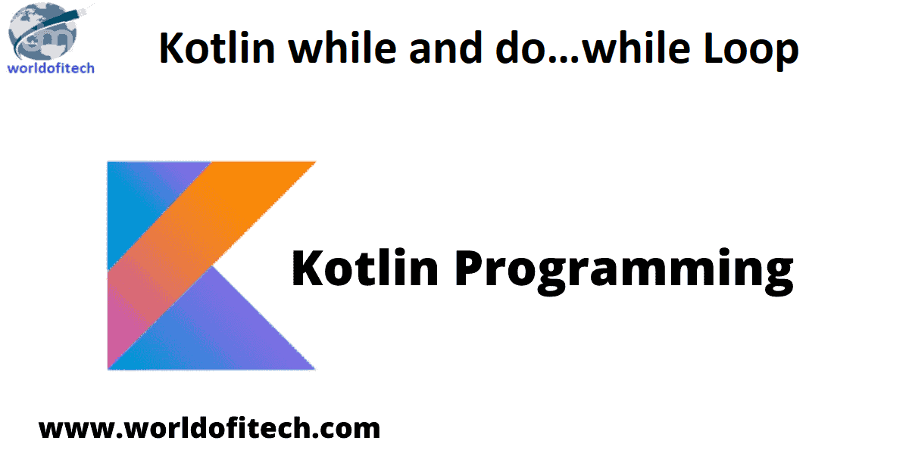

# 流程控制



前面我们学习了`if`、`when`等分支表达式用于条件的判断，对于程序来说，还少不了循环的流程控制，今天我们就来学习两种重要的循环`for`/`do..while`循环。

## for循环

`for`循环可以对任何提供迭代器（iterator）的对象进行遍历，这相当于像Java这样的语言中的`foreach`循环。它遍历数组，范围，集合或提供迭代的任何内容。

语法如下：
```kotlin
for (item in collection){  
    // 循环的主体
}
```

`for`可以循环遍历任何提供了迭代器的对象。即：
* 有一个成员函数或者扩展函数`iterator()`，它的返回类型
* 有一个成员函数或者扩展函数`next()`，并且
* 有一个成员函数或者扩展函数`hasNext()` 返回`Boolean`。

例如：
```kotlin
val marks = arrayOf(80,85,60,90,70)  
for(item in marks){  
    println(item)  
}
```

当然，还可以迭代数组的索引`indices`来迭代数组的元素：
```kotlin
val marks = arrayOf(80,85,60,90,70)  
for(item in marks.indices) {
    println("marks[$item]: "+ marks[item])
} 
```

还可以迭代区间：
```kotlin
for (i in 1..5) {
    print(i)
}
```

## while循环

`while`和`do...while`的使用方式与Java语言基本一致，例如：

```kotlin
var x = 10
while (x > 0) {
    x--
    println(x)
}

var y = 10
do {
    y = y + 1
    println(y)
} while (y < 20)
```

### break 和 continue

这两个与Java语法完全一致：

* **break**：用于完全结束一个循环，直接跳出循环体，然后执行循环后面的语句。
* **continue**：只终止本轮循环，但是还会继续下一轮循环。可以简单理解为，直接在当前语句处中断，跳转到循环入口，执行下一轮循环。