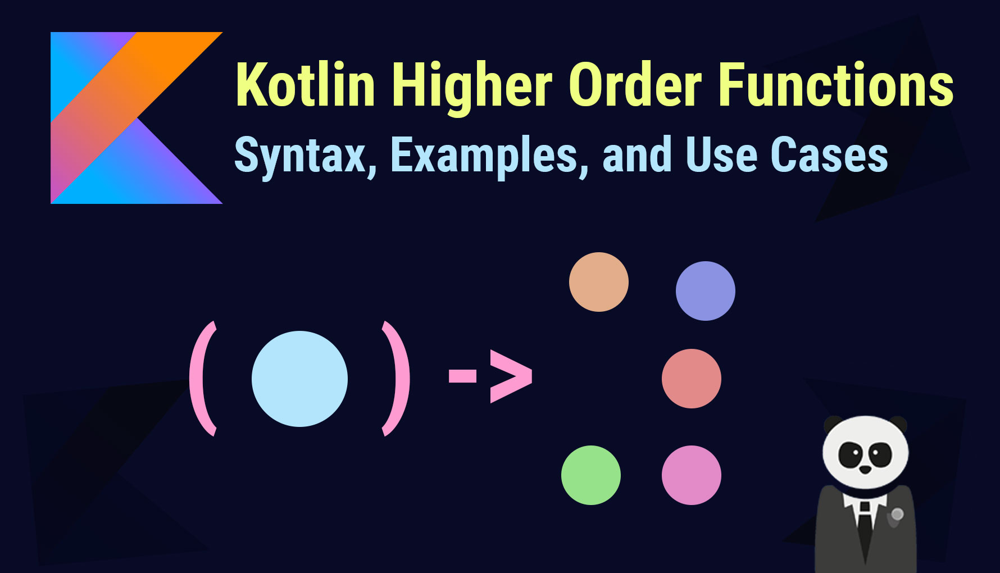

# 高阶函数



Kotlin函数都是头等的，这意味着它们可以存储在变量与数据结构中、作为参数传递给其他高阶函数以及从其他高阶函数返回。可以像操作任何其他非函数值一样操作函数。

在Kotlin中，函数是一种特殊的类型，所以我们就可以将其当做函数参数传递，或者将其当做返回值来用，那么高阶函数就是：

***高阶函数是将函数用作参数或返回值的函数。***

## 作为参数传递

例如：我们可以给集合定义一个累积函数`fold`:

```kotlin
fun <T, R> Collection<T>.fold(
    initial: R, 
    combine: (acc: R, nextElement: T) -> R
): R {
    var accumulator: R = initial
    for (element: T in this) {
        accumulator = combine(accumulator, element)
    }
    return accumulator
}
println(listOf("hello", "world").fold("zhangsan") { acc, nextElement -> acc + " " + nextElement }) // zhangsan hello world
```

在上述代码中，参数`combine`具有函数类型`(R, T) -> R`，因此`fold`接受一个函数作为参数， 该函数接受类型分别为`R`与`T`的两个参数并返回一个`R`类型的值。 在`for-循环`内部调用该函数，然后将其返回值赋值给`accumulator`。

## 作为函数返回

​ 从一个函数中返回另一个函数的需求并不比把函数作为参数传递的需求多，但这个也是很有用的。例如，函数的延时计算或者程序中的一段代码逻辑会跟程序的状态或者其他情况而变，即有多种逻辑。举个栗子，我们可以根据选中的运费计算方法来计算运费。这里定义一个选择适当得计算逻辑的函数，并且将这段逻辑作为函数返回。

```kotlin
enum class Delivery { 
    STANDARD, EXPEDITED //定义枚举的运输类型
}
class Order(val goodCount: Int) //订单类
//传入运输类型，得到运输费的计算函数
fun getCostCaculator(delivery: Delivery): (Order) -> Double { 
    if (delivery == Delivery.STANDARD) {
        return { order -> order.goodCount * 10.4 + 10 }
    }
    return { order -> order.goodCount * 25.5 + 20 }
}

val calculator = getCostCalculator(Delivery.STANDARD)
println(calculator(Order(20))) //218.0
```

## 几个常用高级函数

### let 和 run

这两个高阶函数实际上是一个作用域函数，当你需要定义一个变量在特定的作用域范围内，这两个高阶函数是一个不错的选择，同时，这两个函数还可以帮你避免写一些空判断的操作。这两个函数之间的区别是，let接受的参数是`it`, run接受的参数是`this`.

```kotlin
object.let{
   it.todo()
}

// 作用2：判断object为null的操作
object?.let{//表示object不为null的条件下，才会去执行let函数体
   it.todo()
}
```

例如：

```kotlin
Person("Alice", 20, "Amsterdam").let {
    println(it)
    it.moveTo("London")
    it.incrementAge()
    println(it)
}
```

### apply 和 aslo

这两个函数结构上面和`let`函数很想，唯一不同的是返回值不一样，`let`是以闭包形式返回，返回函数体内最后一行的值，如果最后一行为空就返回一个Unit类型的默认值。而`also`函数返回的则是传入对象的本身。所以，这两个函数大多用于多个扩展函数的链式调用上。

例如：
```kotlin
// let函数
var result = mVar.let {
               it.function1()
               it.function2()
               it.function3()
               999
}
// 最终结果 = 返回999给变量result

// also函数
var result = mVar.also {
               it.function1()
               it.function2()
               it.function3()
               999
}
// 最终结果 = 返回一个mVar对象给变量result
```

### with

调用同一个对象的多个方法/属性时，可以省去对象名重复，直接调用方法名/属性即可。

例如：
```kotlin
// 此处要调用people的name 和 age属性
// kotlin
val people = People("carson", 25)
with(people) {
println("my name is $name, I am $age years old")
}
```

### use

如果需要使用`use`函数, 必须具备以下条件：
* 实现了Closeable接口的对象可调用use函数
* use函数会自动关闭调用者（无论中间是否出现异常）
* Kotlin的File对象和IO流操作变得行云流水

这个用法有点类似于Java中的`try...resource`用法.

例如：
```kotlin
File("text.txt").inputStream().reader().buffered().use {
    println(it.readLins())
}
```