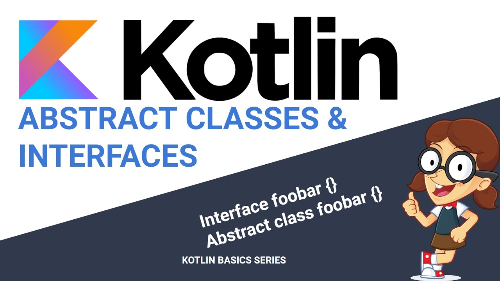

# 类



Kotlin是一门面向对象的语言，所以支持类，抽象类和接口等基本的面向对象语法，今天我们就逐个来学习。

## 类

类的声明定义和Java的十分类似，使用`class`关键字：
```kotlin
class ClassName {
    // class body
}
```

类声明由类名、类头（指定其类型参数、主构造函数等）以及由花括号包围的类体构成。类头与类体都是可选的；如果一个类没有类体，可以省略花括号, 如`class Empty`

如果要生成类的实例，与Java不同，直接省略关键字`new`:

```kotlin
class Person {

}
val person = Person() 
```

这种方式其实默认调用的是类的构造方法进行的初始化。

### 构造方法

在 Kotlin 中的一个类可以有一个主构造函数以及一个或多个次构造函数。主构造函数与Java的定义类似，但是使用关键字`constructor`进行标注。

```kotlin
class Person {
    var name: String = ""
    constructor(name: String) {
        this.name = name
    }
}
```

主构造函数是类头的一部分, 它跟在类名后面，如果主构造函数没有任何注解或者可见性修饰符，可以省略这个`constructor`关键字。
下面的两种写法与上面是等价的：
```kotlin
class Person constructor(var name: String) {}
class Person(var name: String) {}
```

但是这种写法会有一个问题：如何在类的初始化的时候，执行一些业务逻辑呢？即没办法在构造函数里写代码了呀！！！

为了解决这个问题，Kotlin提供了`init`代码块，
```kotlin
class Person(var name: String) {
    init {
        name = "zhangsan"
    }
}
```

此构造函数必须放在类里面，必须以`constructor`关键字开头。 如果类有一个主构造函数，每个次构造函数需要委托给主构造函数， 可以直接委托或者通过别的次构造函数间接委托。委托到同一个类的另一个构造函数用 this 关键字即可：

```kotlin
class Person(val name: String) {
    var children: MutableList<Person> = mutableListOf()
    constructor(name: String, parent: Person) : this(name) {
        parent.children.add(this)
    }
}
```

请注意，初始化块中的代码实际上会成为主构造函数的一部分。委托给主构造函数会作为次构造函数的第一条语句，因此所有初始化块与属性初始化器中的代码都会在次构造函数体之前执行。即使该类没有主构造函数，这种委托仍会隐式发生，并且仍会执行初始化块.

如果一个非抽象类没有声明任何（主或次）构造函数，它会有一个生成的不带参数的主构造函数。构造函数的可见性是 public。如果你不希望你的类有一个公有构造函数，你需要声明一个带有非默认可见性的空的主构造函数：

```kotlin
class DontCreateMe private constructor () { /*……*/ }
```

### 属性和字段

Java中，类的成员变量我们可以称之为`Field(字段)`，我们可以对其提供相应的`getter()`和`setter()`方法来设置和访问其值。相应的，对于Kotlin而言，类的成员变量被称之为`Property(属性)`,相当于Java中的`Field + getter + setter`.

* Java Field:
```java
public class Person {
    private String name;
    void Person(String name) {
        this.name = name
    }

    public String getName() {
        return name;
    }

    public void setName(String name) {
        this.name = name;
    }
}
```
* Kotlin Proterty
```kotlin
class Person(name: String) {
    var name = name
}

val person = Person("zhangsan")
println(person.name)// 默认提供了getter方法
```

如果你想在Kotlin的代码中，通过`getter`和`setter`方法来添加一些特殊的业务逻辑，你可以手动定义这两个方法, 同时，也可以通过属性引用来手动调用这两个函数：
```kotlin
class Person(name: String) {
    var name = name
    get() {
        return field
    }
    set(value) {
        println("Set name: ${value}")
        field = value
    }
}

val person = Person("zhangsan")
var nameRef = person::name 
nameRef.set("lisi")// Set name: lisi
println(nameRef.get())// lisi
```
