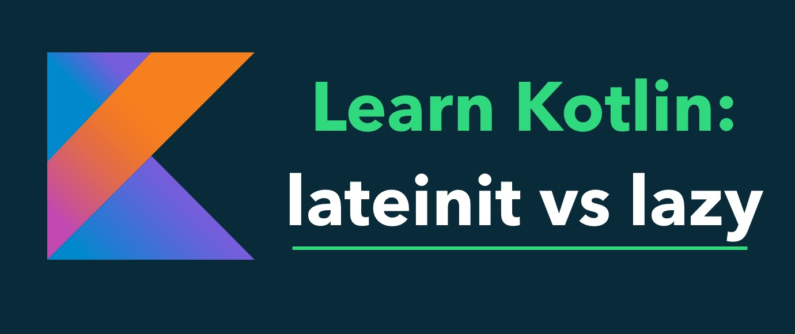

# 类属性的延迟初始化



为什么需要延时初始化呢？关键的原因是类属性必须在构造时初始化，但是有些情况下，构造这个类时不能将属性初始化，必须在类构造完成之后，才能被初始化。这就有点矛盾了，怎么办呢？今天我们来揭晓答案。

## 申明为可空类型
这种方式与Java类似，定义一个可空类型的变量，然后在某个方法中初始化它。

例如：
```kotlin
class student {
    var klass: String? = null

    func assignKlass(klass: String) {
        this.klass = klass
    }
}
```

这种方式其实和Java语法没啥两样，而且最主要的是，每次访问这个属性的时候，都需要使用安全访问符`?.`判断空。所以不推荐使用这种方式。

## lateinit

这种方式是使用关键字`lateinit`申明此属性是需要延迟初始化的属性，告诉编译器在编译期不要去检查变量是否为空：
```kotlin
class student {
    lateinit var klass: String

    func assignKlass(klass: String) {
        if (klass.isInitialized) {
            this.klass = klass
        }
    }
}
```

虽然这个关键字看起来语法稍微好看些，但是本质上和可空类型一样，而且这个`lateinit`的限制比较多：
* 只能修饰变量var，不能修饰常量val
* 不能修饰基本数据类型（因为基本数据类型在类加载的准备阶段会被初始化为默认值）
* 在调用lateinit修饰的变量时，如果还没有初始化，则会抛出未初始化异常
* 可以通过isInitialized检查是否初始化
* 每次需要给变量初始化的时候都需要判断是否已经初始化

所以，也不是特别推荐的写法。

## by lazy

`lazy()` 是接受一个lambda并返回一个 `Lazy <T>`实例的函数, 返回的实例可以作为实现延迟属性的委托： 第一次调用`get()`会执行已传递给`lazy()`的lambda表达式并记录结果，后续调用`get()`只是返回记录的结果。

```kotlin
val lazyValue: String by lazy {
    println("computed!")
    "Hello"
}

fun main() {
    println(lazyValue)
    println(lazyValue)
}
```

运行结果如下：
```bash
computed!
Hello
Hello
```

默认情况下，对于lazy属性的求值是同步锁的（synchronized）：该值只在一个线程中计算，并且所有线程会看到相同的值。如果初始化委托的同步锁不是必需的，这样多个线程可以同时执行，那么将`LazyThreadSafetyMode.PUBLICATION`作为参数传递给`lazy()`函数。 而如果你确定初始化将总是发生在与属性使用位于相同的线程， 那么可以使用`LazyThreadSafetyMode.NONE`模式：它不会有任何线程安全的保证以及相关的开销。

需要注意的是，lazy也有缺陷：
* 只能修饰常量`val`，不能修饰变量`var`
* 在属性第一次使用时自动初始化，且只会加载一次(毕竟人家修饰的是常量)

Lazy是延迟初始化比较好的一种方式，真正做到了延迟初始化，推荐使用。

### 延迟初始化方案对比
| 方案名称 | 推荐指数 | 理由 |
| :-----: | :----: | -----|
| 可空类型 | ⭐️ | 增加代码复杂度，初始化与声明分离，调用处需要判断空处理 |
| lateinit | ⭐️⭐️ | 初始化与声明分离，调用处虽然无需判断空处理，但是潜在的初始化问题可能被掩盖 |
| lazy | ⭐️⭐️⭐️⭐️⭐️ | 初始化与声明内聚，无需声明可空类型 |

## 属性代理

属性代理是代理模式的一种，Kotlin通过这种方式实现了属性延迟初始化，`lazy`就是这种设计的实现，如果`lazy`无法满足你自己的需求的时候，可以自定义相关的属性代理。

语法为：`var/val 属性名: 类型 by 表达式`。

在`by`后面的表达式是该代理， 因为属性对应的`get()`与`set()`会被委托给它的`getValue()` 与 `setValue()`方法。 属性的代理不必实现任何的接口，但是需要提供一个`getValue()`函数与`setValue()`。

例如：
```kotlin
import kotlin.reflect.KProperty

class Delegate {
    operator fun getValue(thisRef: Any?, property: KProperty<*>): String {
        return "$thisRef, thank you for delegating '${property.name}' to me!"
    }
 
    operator fun setValue(thisRef: Any?, property: KProperty<*>, value: String) {
        println("$value has been assigned to '${property.name}' in $thisRef.")
    }
}

class Example {
    var p: String by Delegate()
}

val e = Example()
println(e.p) // Example@33a17727, thank you for delegating ‘p’ to me!
e.p = "NEW" // NEW has been assigned to ‘p’ in Example@33a17727.
```